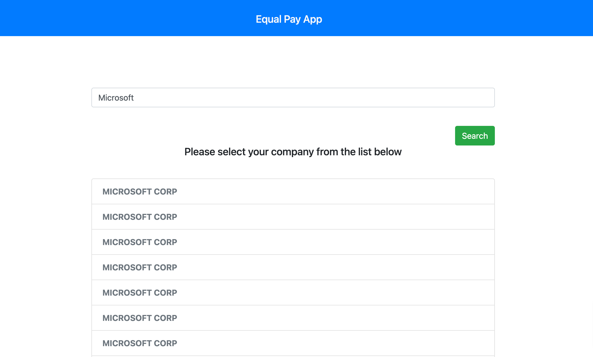
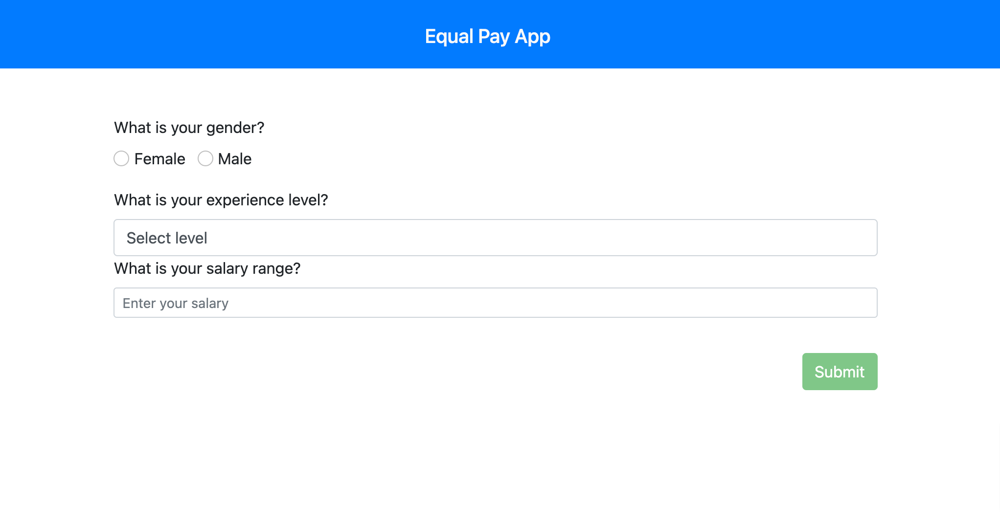
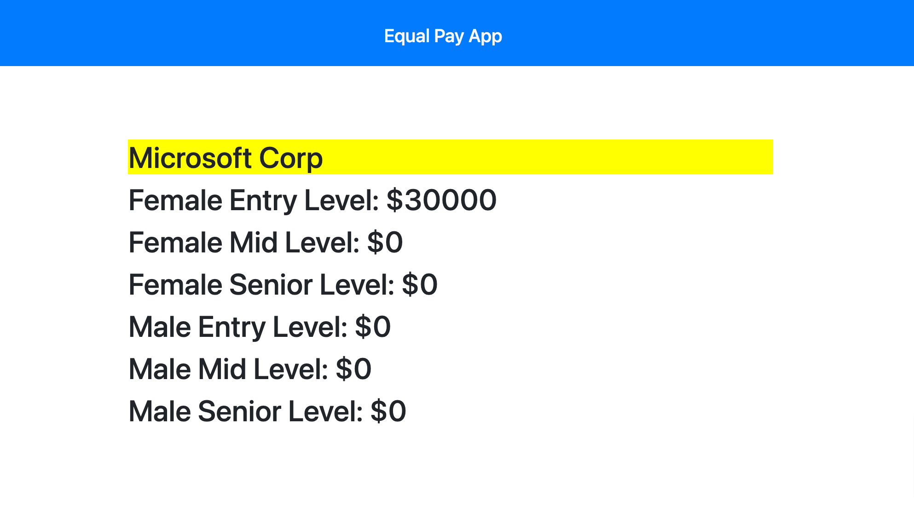

# Equal Pay App

The purpose of this app is to collect salary data for various experience levels to determine whether or not the company is adhering to equal pay laws. 

## Technologies

The application was built with REACT and several NODE packages.

## Pages

https://inclusion-app.herokuapp.com/ 

### MIT License

